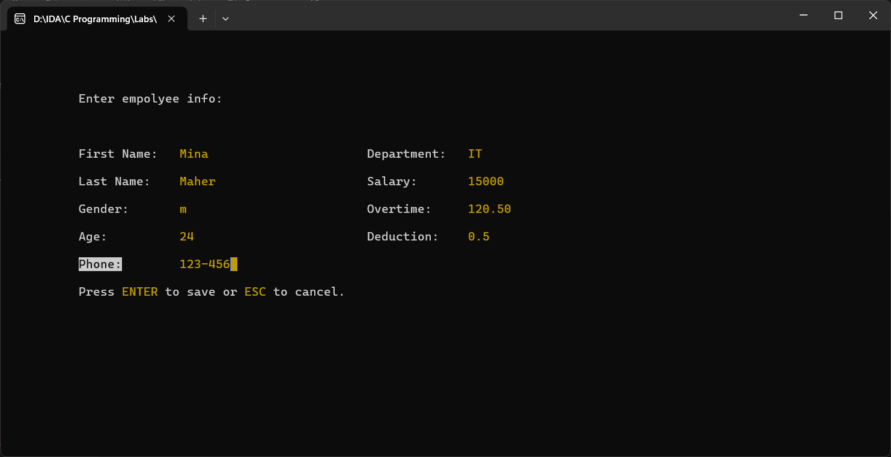

# RetroHR v4.0

This project is an application of the [ITI](https://iti.gov.eg/home) Introduction to C Programming course within the Integrated Software Development & Architecture track.

It is a basic employee management system with the ability to add, delete, and view employee data. The application supports paging the employee list into several 10-item pages, allowing navigation between them. It also includes functionality to save and load data automatically when exiting or starting the program.

## Technology
The entire application is built in C and utilizes the CLI to emulate a GUI using techniques such as:

```c
void gotoxy(int x, int y) {
    COORD coord;
    coord.X = x;
    coord.Y = y;
    SetConsoleCursorPosition(GetStdHandle(STD_OUTPUT_HANDLE), coord);
}
```

This function manipulates the cursor position on the screen. Additionally, the app uses:

```c
#define RESET       "\033[0m"
#define FG_BLACK    "\033[30m"
#define FG_YELLOW   "\033[33m"
#define BG_YELLOW   "\033[43m"

for (int i = 0; i < count; i++) {
    for (int j = 0; j < len[i]; j++) {
        if (i == currentY && j == currentX) {
            printf(FG_BLACK BG_YELLOW);
        } else {
            printf(FG_YELLOW);
        }
        gotoxy((originX + 40 * (i / 5) + j), (originY + 2 * (i % 5)));
        printf("%c", field[i][j]);
        printf(RESET);
    }
}
```

This snippet highlights parts of the text, creating a more visually appealing UI. User input is handled through `getch()` and `switch` cases, eliminating the need for typing commands directly in the CLI.

Moreover, the app utilizes dynamic memory allocation to manage employee data efficiently:

```c
if (*empTotal == *capacity) {
    (*capacity) *= 2;
    Employee* temp = realloc(*empArray, (*capacity) * sizeof(Employee));
    if (temp == NULL) {
        // Reallocation failed
        system("cls");
        gotoxy(10, 4);
        printf("Alert:");
        gotoxy(10, 8);
        printf("No enough memory.");
        gotoxy(10, 10);
        system("pause");
        return;
    }
    // Update the array pointer
    *empArray = temp;
}
```
This ensures the program scales dynamically according to the number of employees.

## Features
When loading the program, the user is welcomed to the main menu, where they can choose to view existing employees or add a new one.


### 1. View Employees
When selecting the view option, the user is presented with a paginated list of up to 10 items per page. They can navigate between items using `UP` and `DOWN` keys, switch pages using `RIGHT` and `LEFT`, view a selected item with `ENTER`, or delete it with `DEL`.


#### View Details
Pressing `ENTER` displays detailed information about the selected employee.


#### Delete Employee
Pressing `DEL` prompts a confirmation message before deleting the selected employee.


### 2. Add Employee
In the main menu, users can choose to add a new employee. A custom multi-line editor is launched to handle data input and validation, allowing users to move freely within the input form and edit fields dynamically.



#### Cancel Operation
Users can cancel the operation at any moment by pressing `ESC`.


#### Submit Data
The submission will only be accepted if all fields are filled correctly.


### Auto Save/Load
When the user exits the program, the data is automatically saved to a dedicated file. Upon relaunching, the program attempts to restore the data, notifying the user if the operation was successful or failed.

